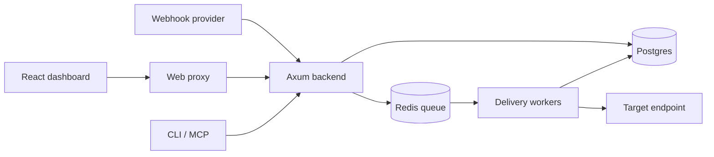

# Architecture

- **backend** menangani ingest, API, auth, queue, dan worker.
- **frontend** adalah React + Vite SPA.
- **web** meng-embed bundle SPA dan reverse-proxy path API ke backend.
- **tui** menyediakan CLI operasional.
- **mcp** menyediakan tool berbasis stdio JSON-RPC untuk AI client.
- **receiver** adalah target contoh untuk development.

Ingest publik tidak menunggu target selesai. Event disimpan dan diantrikan dahulu, sehingga latency provider tidak bergantung pada target.
