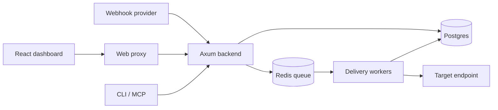

# Architecture

- **backend** handles ingest, the API, authentication, the queue, and workers.
- **frontend** is a React + Vite SPA.
- **web** embeds the SPA bundle and reverse-proxies API paths to the backend.
- **tui** provides an operational CLI.
- **mcp** provides stdio JSON-RPC tools for AI clients.
- **receiver** is an example target for development.

Public ingest does not wait for the target to finish. Events are stored and queued first, so provider latency does not depend on downstream delivery.
